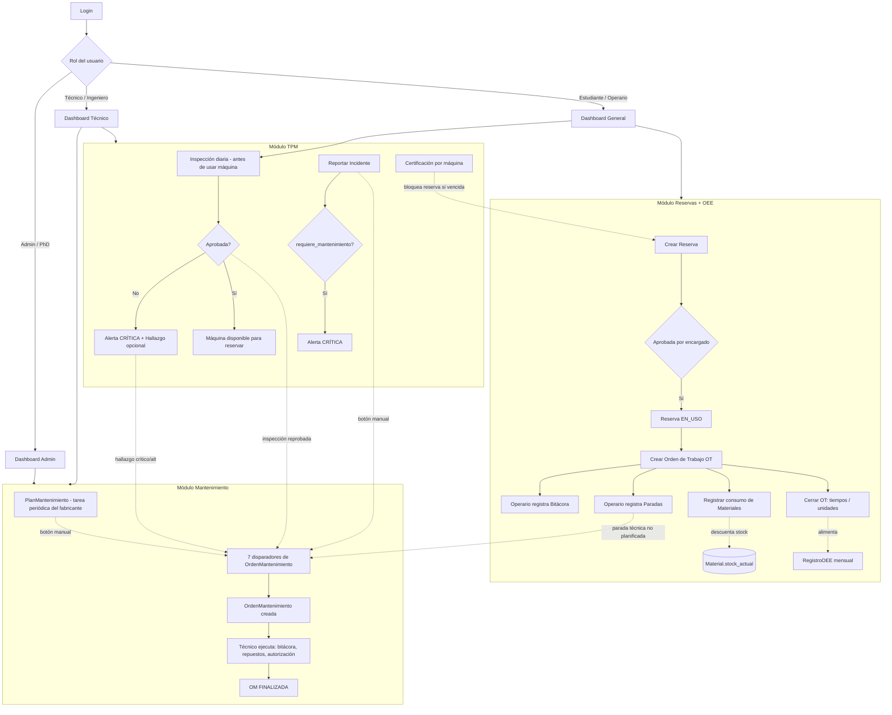
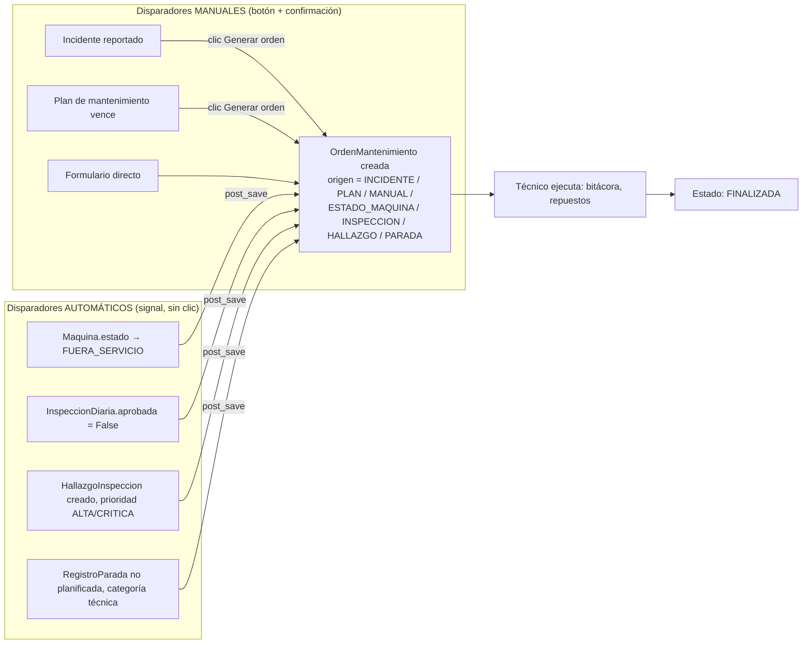

# Flujo completo de la aplicación — ERP CIDIIE

> Documento de referencia técnica. Generado a partir del código fuente real (modelos, vistas, urls, signals) al 2026-06-16.
> Objetivo: tener en un solo lugar el mapa completo del sistema para planificar cambios futuros sin tener que releer todo el código.

---

## 1. Stack y estructura general

- **Backend**: Django 6.0.5, PostgreSQL (`erp_laboratorio`)
- **Apps** (en orden de dependencia, cada una con su `urls.py` incluido desde `config/urls.py`):

| App | Prefijo URL | Responsabilidad |
|---|---|---|
| `usuarios` | `/` | Autenticación, roles, dashboards, inspección diaria (login) |
| `maquinas` | `/maquinas/` | Máquinas, piezas (despiece jerárquico), transferencias, códigos de parada |
| `mantenimiento` | `/mantenimiento/` | Planes de mantenimiento, registro de mantenimientos, **Órdenes de Mantenimiento (OM)**, bitácora técnica |
| `inventario` | `/inventario/` | Materiales, consumo de materiales |
| `reservas` | `/reservas/` | Reservas de máquina, Órdenes de Trabajo (OT), paradas, bitácora de operario |
| `tpm` | `/tpm/` | Inspecciones diarias, hallazgos, incidentes, certificaciones, OEE, alertas |
| `reportes` | `/reportes/` | Generación de reportes Excel (openpyxl) |

- **Referencia arquitectónica**: el sistema legado en Access/VBA de DANEC (`guia/DANEC.ACCDB`) es la base conceptual de `OrdenMantenimiento` / `BitacoraMantenimiento` (tablas `tabOrden`, `tabBitacora`).
- **Patrón de borrado**: soft-delete vía campo `activo=False` en casi todos los modelos (no hay DELETE real salvo casos puntuales de "eliminar definitivo").
- **Patrón de automatización**: Django signals (`post_save`, `pre_save`) registrados en `apps.py → ready()`, más un management command (`generar_alertas`) para chequeos periódicos vía cron.

---

## 2. Roles y autenticación

Login único en `/` (`usuarios.views.login_view`). No hay registro público — los usuarios los crea un administrador.

`Usuario` (extiende `AbstractUser`): `cedula` (único), `telefono`, `rol` (FK a `Rol`), `permisos_personalizados` (M2M a `Permiso`), `estado` (`ACTIVO`/`INACTIVO`/`SUSPENDIDO`).

Tras login, `redirigir_por_rol()` decide el dashboard según el nombre del rol (comparación case-insensitive por substring, **no por un campo booleano dedicado**, y desde 2026-06-16 también **insensible a tildes** vía `_normalizar_rol()` — ver más abajo):

| Si el nombre normalizado del rol contiene... | Redirige a | Vista |
|---|---|---|
| usuario es `is_superuser` | `dashboard_admin` | `usuarios.views.dashboard_admin` |
| "administrador" o "phd" | `dashboard_admin` | ídem |
| "tecnico" o "ingeniero" | `dashboard_tecnico` | `usuarios.views.dashboard_tecnico` |
| cualquier otro rol (ej. estudiante, operario) | `dashboard_general` | `usuarios.views.dashboard_general` |

`es_admin(user)` / `es_admin_o_tecnico(user)` (helpers duplicados de forma idéntica en `usuarios`, `maquinas`, `mantenimiento`, `reservas`, `tpm` e `inventario` — no hay un módulo de permisos compartido) usan la misma lógica de substring para autorizar acciones administrativas (crear/editar/eliminar usuarios, máquinas, planes, órdenes, etc.).

**`Usuario.permisos_personalizados`** (M2M a `Permiso`) existe en el modelo y en `/admin/`, pero **no se usa en ningún lugar del código de negocio** — es un campo sin efecto real hoy, no un sistema de permisos granular activo.

**Bug corregido (2026-06-16)**: el rol cargado en BD era literalmente `"TECNICO"` (sin tilde), pero el código comparaba contra el substring `"técnico"` (con tilde) — `'técnico' in 'tecnico'` es `False` en Python, así que ese rol no otorgaba ningún permiso elevado en ningún módulo y redirigía a `dashboard_general` en vez de `dashboard_tecnico`. Se corrigió agregando una función `_normalizar_rol()` en cada uno de los 6 archivos (`unicodedata.normalize('NFKD', ...)` + `encode('ascii','ignore')`) que quita tildes antes de comparar, y cambiando los substrings de búsqueda a su forma sin tilde (`'tecnico'`). **Importante para roles futuros**: como la verificación sigue siendo por texto libre en `Rol.nombre`, evitar que el nombre de un rol nuevo contenga accidentalmente "administrador", "phd", "tecnico" o "ingeniero" (con o sin tilde) si no se desea ese nivel de acceso.

### Contenido de cada dashboard
- **Admin**: conteos globales de máquinas por estado, mantenimientos próximos/vencidos, stock bajo, reservas pendientes, OT en proceso, alertas activas/críticas.
- **Técnico**: mantenimientos programados/en proceso/vencidos, inspecciones de hoy (hechas y fallidas), máquinas operativas sin inspección hoy, OT abiertas/en proceso, stock bajo.
- **General** (estudiante/operario): máquinas operativas, sus propias últimas 5 reservas, si ya hizo su inspección diaria hoy.

---

## 3. Diagrama general del flujo



---

## 4. Módulo `usuarios`

### Modelos
- **`Rol`**: `nombre` (único), `descripcion`.
- **`Permiso`**: `nombre` (único), `descripcion` — granularidad fina, vía `Usuario.permisos_personalizados` (M2M), poco usado hoy fuera del rol.
- **`Usuario`**: ver sección 2.

### Vistas / URLs (`usuarios/urls.py`, montado en `/`)
| URL | Vista | Notas |
|---|---|---|
| `/` | `login_view` | GET/POST login |
| `/logout/` | `logout_view` | |
| `/dashboard/admin/` | `dashboard_admin` | |
| `/dashboard/tecnico/` | `dashboard_tecnico` | |
| `/dashboard/` | `dashboard_general` | |
| `/inspeccion/` | `inspeccion_diaria` | Formulario de checklist diario (ver módulo TPM) |
| `/usuarios/` | `lista_usuarios` | solo admin |
| `/usuarios/crear/` | `crear_usuario` | solo admin |
| `/usuarios/<pk>/` | `detalle_usuario` | solo admin |
| `/usuarios/<pk>/editar/` | `editar_usuario` | solo admin |
| `/usuarios/<pk>/estado/` | `cambiar_estado_usuario` | activar/inactivar/suspender |
| `/usuarios/<pk>/eliminar/` | `eliminar_usuario` | solo admin |

---

## 5. Módulo `maquinas`

### Modelos

**`Maquina`**: identificación (`nombre`, `codigo` único, `numero_serie`, `codigo_barras_universidad`), fabricante/modelo/año, `ubicacion`, `descripcion`, `estado` (`OPERATIVA` / `MANTENIMIENTO` / `FUERA_SERVICIO`), `responsable` (FK Usuario), archivos (`imagen`, `manual_pdf`), **ficha técnica completa** para validar inspecciones (voltaje, frecuencia, rango de presión neumática, capacidad de refrigerante, RPM máximo de husillo, tipo de control CNC, dimensiones/peso). Propiedad `disponible_para_reserva` = `estado == 'OPERATIVA'`.

**`CodigoParada`**: catálogo de causas de parada, **scopeado por fabricante + modelo de máquina** (no por instancia individual — así varias máquinas del mismo modelo comparten catálogo). Campos: `tipo` (`PLANIFICADA`/`NO_PLANIFICADA`), `categoria` (mecánica, eléctrica, neumática, lubricación, refrigeración, control CNC, seguridad, operación, otro), `subsistema`, `causa_raiz_comun`. Único por `(fabricante, modelo_maquina, codigo)`.

**`Pieza`**: jerarquía auto-referenciada de 2 niveles (inspirada en el manual de despiece de la F210HSC):
- Nivel 1 = Ensamble/Baugruppe (`es_ensamble=True`, `ensamble=NULL`)
- Nivel 2 = Pieza individual (`es_ensamble=False`, `ensamble=<nivel1>`)

Campos: nombres en 3 idiomas (`nombre`, `nombre_original`, `nombre_en`), `numero_parte` (Artikelnummer), `numero_posicion`, `especificacion`, `cantidad_en_maquina`, ubicación física + imágenes, `stock_repuestos` / `stock_minimo_repuestos` (propiedad `stock_bajo`). Método `get_ruta_completa()` da `Máquina › Ensamble › Pieza`.

**`TransferenciaPieza`**: mueve una pieza entre `maquina_origen` y `maquina_destino` (FKs reales, no texto), con `autorizado_por` y `motivo`.

### Vistas / URLs (`maquinas/urls.py`, montado en `/maquinas/`)
| URL | Vista |
|---|---|
| `/maquinas/codigos-parada/` | `lista_codigos_parada` |
| `/maquinas/codigos-parada/crear/` | `crear_codigo_parada` |
| `/maquinas/codigos-parada/<pk>/` | `detalle_codigo_parada` |
| `/maquinas/codigos-parada/<pk>/editar/` | `editar_codigo_parada` |
| `/maquinas/codigos-parada/<pk>/eliminar/` | `eliminar_codigo_parada` |
| `/maquinas/transferencias/` | `lista_transferencias` |
| `/maquinas/piezas/<pk>/editar/` | `editar_pieza` |
| `/maquinas/piezas/<pk>/eliminar/` | `eliminar_pieza` |
| `/maquinas/piezas/<pieza_pk>/transferir/` | `crear_transferencia` |
| `/maquinas/` | `lista_maquinas` |
| `/maquinas/crear/` | `crear_maquina` |
| `/maquinas/<pk>/` | `detalle_maquina` |
| `/maquinas/<pk>/editar/` | `editar_maquina` |
| `/maquinas/<pk>/eliminar/` | `eliminar_maquina` |
| `/maquinas/<pk>/estado/` | `cambiar_estado_maquina` | **← dispara el trigger automático de OM si pasa a FUERA_SERVICIO** |
| `/maquinas/<maquina_pk>/piezas/crear/` | `crear_pieza` |

---

## 6. Módulo `reservas` (uso operativo + OEE)

### Modelos

**`Reserva`**: `usuario`, `maquina`, `autorizador`, `fecha`/`hora_inicio`/`hora_fin`, `proposito` (enseñanza, investigación, producción, pedido externo), `estado` (`PENDIENTE` → `APROBADA` → `EN_USO` → `COMPLETADA` / `CANCELADA`). `clean()` valida: hora_fin > hora_inicio, máquina debe estar `OPERATIVA`, y que no haya solapamiento de horario con otra reserva activa de la misma máquina.

**`OrdenTrabajo`** (OT): 1-a-1 con `Reserva`. Es el documento donde se ejecuta el trabajo. `estado` (`ABIERTA`→`EN_PROCESO`→`FINALIZADA`/`CANCELADA`). **Campos para cálculo de OEE**: `tiempo_planificado_min`, `tiempo_real_min`, `tiempo_parada_min`, `unidades_producidas`, `unidades_esperadas`, `unidades_sin_defecto`. Estos alimentan el `RegistroOEE` mensual del módulo TPM.

**`RegistroParada`**: paradas dentro de una OT, referenciando un `CodigoParada` del catálogo del modelo de máquina. `duracion_minutos` se calcula automáticamente en `save()` a partir de `hora_inicio`/`hora_fin`.

**`BitacoraOperario`**: entradas de texto libre del operario durante la ejecución de la OT (puede haber varias por OT), con flag `requiere_atencion` y foto opcional.

### Vistas / URLs (`reservas/urls.py`, montado en `/reservas/`)
| URL | Vista |
|---|---|
| `/reservas/` | `lista_reservas` |
| `/reservas/crear/` | `crear_reserva` |
| `/reservas/<pk>/` | `detalle_reserva` |
| `/reservas/<pk>/editar/` | `editar_reserva` |
| `/reservas/<pk>/estado/` | `cambiar_estado_reserva` |
| `/reservas/<pk>/cancelar/` | `cancelar_reserva` |
| `/reservas/ordenes/` | `lista_ordenes` |
| `/reservas/ordenes/crear/<reserva_pk>/` | `crear_orden` |
| `/reservas/ordenes/<pk>/` | `detalle_orden` |
| `/reservas/ordenes/<pk>/cerrar/` | `cerrar_orden` |
| `/reservas/ordenes/<orden_pk>/parada/` | `agregar_parada` | **← dispara Alerta y, si es PNP técnica, dispara OM automática** |
| `/reservas/ordenes/<orden_pk>/bitacora/` | `agregar_bitacora` |
| `/reservas/ordenes/<orden_pk>/consumo/` | `registrar_consumo` | descuenta stock de `inventario.Material` |

---

## 7. Módulo `tpm` (Total Productive Maintenance)

Cubre los pilares: P1 Autónomo, P2 Preventivo (compartido con `mantenimiento`), P3 Mejora/OEE, P4 Formación/Certificaciones, P7 Seguridad/Incidentes.

### Modelos

**`CertificacionUsuario`**: certifica que un `usuario` puede operar una `maquina`, con `fecha_otorgamiento`/`fecha_vencimiento` y `otorgado_por`. Propiedades `vigente` y `dias_para_vencer`. Sin certificación vigente, el sistema debería impedir la reserva (la lógica de bloqueo vive en las vistas de reservas/dashboard, no como constraint de modelo).

**`InspeccionDiaria`** (Pilar 1): checklist que el operario llena **antes de usar la máquina**. Único por `(maquina, fecha)`. Campos booleanos: nivel de aceite, presión neumática, nivel de refrigerante, limpieza de área, guardas de seguridad, botón de emergencia (estos 4+2 son los "críticos"), más `ruidos_anormales` y `vibraciones_anormales` (anomalías). El campo `aprobada` se calcula automáticamente en `save()`:
```python
aprobada = (aceite_ok AND presion_ok AND guardas_ok AND boton_emergencia_ok) AND NOT (ruidos_anormales OR vibraciones_anormales)
```
Si `aprobada=False` → dispara **Alerta crítica** (`tpm/signals.py`) y **Orden de Mantenimiento automática** (`mantenimiento/signals.py`).

**`HallazgoInspeccion`**: hallazgo asociado a una `InspeccionDiaria`, con `prioridad` (BAJA/MEDIA/ALTA/CRITICA) y `resuelto`. Si la prioridad es ALTA o CRITICA al crearse → dispara **Orden de Mantenimiento automática**.

**`Incidente`** (Pilar 7): `tipo` (casi accidente, condición de riesgo, accidente, anomalía operacional), `severidad`, `descripcion`, `accion_tomada`, `requiere_mantenimiento` (bool). Si `requiere_mantenimiento=True` al crearse → Alerta crítica. La generación de OM desde un incidente sigue siendo **manual** (botón en el detalle del incidente), porque no todo incidente implica necesariamente una intervención de mantenimiento — el técnico decide.

**`RegistroOEE`** (Pilar 3): por `maquina` + `mes`/`anio` (único). `disponibilidad`, `rendimiento`, `calidad` (0-100 cada uno), y `oee` calculado automáticamente en `save()`: `oee = (disponibilidad × rendimiento × calidad) / 10000`. Se alimenta agregando los datos de las `OrdenTrabajo` cerradas del período (vía `calcular_oee` view).

**`Alerta`**: tabla de persistencia de TODAS las notificaciones del sistema (no solo "semáforos en pantalla" que se pierden). 8 tipos: mantenimiento próximo/vencido, stock bajo, inspección fallida, certificación por vencer/vencida, incidente, parada no planificada. 3 niveles de severidad. Ciclo de vida: `generada_en` → `vista_por`/`vista_en` (opcional) → `resuelta`/`resuelta_en`/`resuelta_por`. Se genera por dos vías (ver sección 9).

### Vistas / URLs (`tpm/urls.py`, montado en `/tpm/`)
| URL | Vista |
|---|---|
| `/tpm/` | `dashboard_tpm` |
| `/tpm/inspecciones/` | `lista_inspecciones` |
| `/tpm/inspecciones/<pk>/` | `detalle_inspeccion` |
| `/tpm/inspecciones/<inspeccion_pk>/hallazgos/crear/` | `agregar_hallazgo` | **← dispara OM si prioridad ALTA/CRITICA** |
| `/tpm/hallazgos/<pk>/editar/` | `editar_hallazgo` |
| `/tpm/hallazgos/<pk>/resolver/` | `resolver_hallazgo` |
| `/tpm/hallazgos/<pk>/eliminar/` | `eliminar_hallazgo` |
| `/tpm/certificaciones/` | `lista_certificaciones` |
| `/tpm/certificaciones/crear/` | `crear_certificacion` |
| `/tpm/certificaciones/<pk>/editar/` | `editar_certificacion` |
| `/tpm/certificaciones/<pk>/revocar/` | `revocar_certificacion` |
| `/tpm/incidentes/` | `lista_incidentes` |
| `/tpm/incidentes/crear/` | `crear_incidente` |
| `/tpm/incidentes/<pk>/` | `detalle_incidente` | botón "Generar orden" (manual) |
| `/tpm/incidentes/<pk>/editar/` | `editar_incidente` |
| `/tpm/oee/` | `lista_oee` |
| `/tpm/oee/calcular/` | `calcular_oee` |
| `/tpm/alertas/` | `lista_alertas` |
| `/tpm/alertas/<pk>/resolver/` | `resolver_alerta` |

La ruta `usuarios.views.inspeccion_diaria` (`/inspeccion/`) es la entrada principal al checklist, presentada justo después del login.

---

## 8. Módulo `mantenimiento` — el corazón del sistema de órdenes

### Modelos

**`PlanMantenimiento`**: la PLANTILLA periódica recomendada por el fabricante (ej. manual de la F210HSC: lubricación de guías cada 8h, verificación neumática cada 40h, cambio de filtro cada 500h, revisión de husillo cada 2000h). Campos: `maquina`, `nombre_tarea`, `descripcion_detallada`, `tipo_tpm` (P1/P2/P3/P7), `intervalo_valor` + `intervalo_unidad` (horas/días/semanas/meses), `activo`.

**`Mantenimiento`** (legado, registro de ejecución simple): vinculado opcionalmente a un `PlanMantenimiento`, con `tipo`, `estado` (`PROGRAMADO`/`EN_PROCESO`/`FINALIZADO`/`CANCELADO`), `prioridad`, fechas, `proxima_fecha` (recalculada al finalizar), `horas_trabajo`, `costo`. Propiedades `esta_vencido` y `dias_para_vencer`. Este modelo sigue existiendo en paralelo a `OrdenMantenimiento` — es el registro "rápido" de historial, mientras que OM es el documento formal de trabajo.

**`OrdenMantenimiento`** (OM, estilo DANEC `tabOrden`) — el documento de trabajo formal, independiente de reservas:

- `tipo`: PREVENTIVO / CORRECTIVO
- `estado`: PROGRAMADA / EN_PROCESO / FINALIZADA / CANCELADA
- `prioridad`: BAJA / MEDIA / ALTA / CRITICA
- **`origen`** (el campo clave de este sistema, 7 valores posibles — ver sección 9)
- FKs de procedencia (todas opcionales, `SET_NULL`, solo una se llena según `origen`): `plan`, `incidente`, `inspeccion`, `hallazgo`, `parada`
- Hasta 3 responsables (`responsable_1/2/3`), como en DANEC
- `fecha_programada`, `fecha_inicio`, `fecha_fin`, `tiempo_estimado_horas`
- `repuestos_necesarios`, `acciones_realizadas`, `observaciones`
- Flags de impacto: `afecta_seguridad`, `para_produccion`
- `costo`
- Visto bueno: `autorizado_por` + `fecha_autorizacion`
- `numero()` → `OM-0001`, etc.

**`BitacoraMantenimiento`** (estilo DANEC `tabBitacora`): historial a nivel de MÁQUINA (no de orden) — permite ver todo lo hecho a una máquina en un solo lugar, aunque venga de distintas OM. Vinculada opcionalmente a una `orden`, siempre a un `tecnico`. Campos: `descripcion`, `observaciones`, `repuestos_utilizados`, `requiere_atencion`, `foto`.

### Vistas / URLs (`mantenimiento/urls.py`, montado en `/mantenimiento/`)
| URL | Vista |
|---|---|
| `/mantenimiento/` | `lista_mantenimientos` |
| `/mantenimiento/crear/` | `crear_mantenimiento` |
| `/mantenimiento/<pk>/` | `detalle_mantenimiento` |
| `/mantenimiento/<pk>/editar/` | `editar_mantenimiento` |
| `/mantenimiento/<pk>/eliminar/` | `eliminar_mantenimiento` |
| `/mantenimiento/<pk>/estado/` | `cambiar_estado_mantenimiento` |
| `/mantenimiento/planes/` | `lista_planes` |
| `/mantenimiento/planes/crear/` | `crear_plan` |
| `/mantenimiento/planes/<pk>/` | `detalle_plan` | botón "Generar orden de mantenimiento" (manual) + lista de OM generadas |
| `/mantenimiento/planes/<pk>/editar/` | `editar_plan` |
| `/mantenimiento/planes/<pk>/eliminar/` | `eliminar_plan` |
| `/mantenimiento/planes/<pk>/restaurar/` | `restaurar_plan` |
| `/mantenimiento/planes/<pk>/eliminar-definitivo/` | `eliminar_plan_definitivo` |
| `/mantenimiento/ordenes/` | `lista_ordenes_mantenimiento` |
| `/mantenimiento/ordenes/crear/` | `crear_orden_mantenimiento` | recibe `?incidente=<pk>` o `?plan=<pk>&maquina=<pk>` por query string |
| `/mantenimiento/ordenes/<pk>/` | `detalle_orden_mantenimiento` | muestra el origen y enlaza de vuelta a la fuente |
| `/mantenimiento/ordenes/<pk>/editar/` | `editar_orden_mantenimiento` |
| `/mantenimiento/ordenes/<pk>/estado/` | `cambiar_estado_om` |
| `/mantenimiento/ordenes/<pk>/eliminar/` | `eliminar_orden_mantenimiento` |
| `/mantenimiento/ordenes/<om_pk>/bitacora/` | `agregar_entrada_bitacora` |
| `/mantenimiento/bitacora/<maquina_pk>/` | `bitacora_maquina` | historial completo por máquina |

---

## 9. Los 7 disparadores de `OrdenMantenimiento` (`origen`)

Este es el corazón de la lógica de automatización, repartido entre **2 modos**: manual (botón + confirmación humana) y automático (signal, sin clic).

| `origen` | Modo | Dónde se dispara | Condición exacta | Implementado en |
|---|---|---|---|---|
| `MANUAL` | Manual | Form. de creación directa | El usuario llena el formulario sin pasar por ningún flujo especial | `mantenimiento/views.py: crear_orden_mantenimiento` (default) |
| `INCIDENTE` | Manual (botón) | Detalle de un `Incidente` | Técnico/admin hace clic en "Generar orden" desde `detalle_incidente.html` | `views.crear_orden_mantenimiento` con `?incidente=<pk>` |
| `PLAN` | Manual (botón) | Detalle de un `PlanMantenimiento` | Técnico/admin hace clic en "Generar orden de mantenimiento" desde `detalle_plan.html` | `views.crear_orden_mantenimiento` con `?plan=<pk>&maquina=<pk>` |
| `ESTADO_MAQUINA` | **Automático** | `Maquina.estado` cambia a `FUERA_SERVICIO` | El estado anterior (capturado en `pre_save`) era distinto de `FUERA_SERVICIO` y el nuevo es `FUERA_SERVICIO`. Dedupe: no crea otra si ya hay una OM activa con este origen para la máquina que no esté FINALIZADA/CANCELADA. | `mantenimiento/signals.py: orden_por_falla_maquina` |
| `INSPECCION` | **Automático** | `InspeccionDiaria` se guarda | `aprobada == False`. Dedupe vía `get_or_create(maquina, origen='INSPECCION', inspeccion=instance)` — una OM por inspección reprobada. | `mantenimiento/signals.py: orden_por_inspeccion_fallida` |
| `HALLAZGO` | **Automático** | `HallazgoInspeccion` se crea | `created=True` y `prioridad` en (`CRITICA`, `ALTA`). Dedupe vía `get_or_create(maquina, origen='HALLAZGO', hallazgo=instance)`. | `mantenimiento/signals.py: orden_por_hallazgo_critico` |
| `PARADA` | **Automático** | `RegistroParada` se crea | `created=True`, el `codigo_parada` existe, es `tipo='NO_PLANIFICADA'` y `categoria` es técnica (MECANICA, ELECTRICA, NEUMATICA, LUBRICACION, REFRIGERACION o CONTROL_CNC — **no** SEGURIDAD/OPERACION/OTRO). Dedupe vía `get_or_create(maquina, origen='PARADA', parada=instance)`. | `mantenimiento/signals.py: orden_por_parada_tecnica` |

### Por qué Incidente y Plan siguen siendo manuales
- Un incidente con `requiere_mantenimiento=True` ya dispara una **Alerta** automática (no una orden) — el técnico revisa y decide si amerita una OM formal, porque algunos incidentes son de seguridad/proceso sin reparación física asociada.
- Un Plan es una recurrencia (cada N horas/días): automatizar la creación de OM exigiría un scheduler que sepa calcular "cuándo toca" comparando horas de uso real de la máquina — eso no existe todavía (ver sección 11, posibles próximos pasos). Hoy el técnico decide cuándo generar la orden del plan.

### Por qué los 4 automáticos sí lo son
Fueron elegidos explícitamente porque representan **condiciones críticas e inequívocas** donde no tiene sentido esperar una decisión humana para abrir el documento de trabajo: una máquina ya está fuera de servicio, una inspección de seguridad ya falló, un hallazgo ya se catalogó como crítico/alto, o ya ocurrió una parada técnica no planificada. En los 4 casos la orden se crea con prioridad ALTA o CRITICA y tipo CORRECTIVO.

### Registro de cada signal (`mantenimiento/signals.py`)
```python
@receiver(pre_save, sender='maquinas.Maquina')      # guarda estado anterior en instance._estado_anterior
@receiver(post_save, sender='maquinas.Maquina')      # orden_por_falla_maquina
@receiver(post_save, sender='tpm.InspeccionDiaria')  # orden_por_inspeccion_fallida
@receiver(post_save, sender='tpm.HallazgoInspeccion')# orden_por_hallazgo_critico
@receiver(post_save, sender='reservas.RegistroParada') # orden_por_parada_tecnica
```
Activado vía `mantenimiento/apps.py → MantenimientoConfig.ready()`.

### Diagrama de disparadores



---

## 10. Módulos `inventario` y `reportes`

### `inventario`
- **`Material`**: `codigo` (único), `nombre`, `tipo` (MANTENIMIENTO/PRODUCCION/AMBOS), `stock_actual`, `stock_minimo` (propiedad `stock_bajo`), `unidad_medida`, `costo_unitario`.
- **`ConsumoMaterial`**: vincula un consumo a una `OrdenTrabajo` (de reservas). **Al guardarse por primera vez, descuenta automáticamente** `material.stock_actual -= cantidad` (en `ConsumoMaterial.save()`).
- URLs: `/inventario/`, `/crear/`, `/<pk>/`, `/<pk>/editar/`, `/<pk>/stock/` (ajuste manual), `/<pk>/eliminar/`.
- **Nota**: el consumo de materiales hoy solo se vincula a `OrdenTrabajo` (reservas), no a `OrdenMantenimiento`. Si una OM consume repuestos, queda registrado como texto libre en `repuestos_necesarios`/`acciones_realizadas`, no como movimiento de stock estructurado.

### `reportes`
- **`ReporteGenerado`**: registro de cada reporte Excel generado — `tipo` (7 tipos: inventario, mantenimiento, reservas, TPM-OEE, TPM-Pareto, TPM-Inspecciones, piezas), `generado_por`, período (`fecha_inicio_periodo`/`fecha_fin_periodo`), `archivo` (FileField), `observaciones`.
- Generación real vía `openpyxl` en las vistas `generar_*`.
- URLs: `/reportes/`, `/generar/inventario/`, `/generar/mantenimiento/`, `/generar/inspecciones/`, `/generar/oee/`, `/generar/reservas/`, `/generar/pareto/`.

---

## 11. Automatizaciones del sistema — resumen cruzado

### A. Signals en tiempo real

**`tpm/signals.py`** (genera `Alerta`):
| Evento | Condición | Tipo de alerta | Severidad |
|---|---|---|---|
| `InspeccionDiaria` guardada | `aprobada=False` | `INSPECCION_FALLIDA` | CRITICA |
| `Incidente` creado | `requiere_mantenimiento=True` | `INCIDENTE` | CRITICA |
| `RegistroParada` creado | `codigo_parada.tipo == 'NO_PLANIFICADA'` | `PARADA_NO_PLANIFICADA` | ADVERTENCIA |

**`mantenimiento/signals.py`** (genera `OrdenMantenimiento`): ver tabla completa en sección 9.

### B. Management command periódico (cron diario)
`tpm/management/commands/generar_alertas.py` — pensado para correr a las 7am vía crontab en el servidor (`0 7 * * * ... manage.py generar_alertas`). No genera duplicados (`get_or_create` en todos los casos). Tres sub-rutinas:
1. **`_alertas_mantenimiento`**: revisa `Mantenimiento` (el modelo legado, no OM) en estado PROGRAMADO/EN_PROCESO → alerta CRITICA si `fecha_programada < hoy` (vencido), o ADVERTENCIA si vence en ≤7 días (próximo).
2. **`_alertas_stock`**: `Material` con `stock_actual <= stock_minimo` → alerta ADVERTENCIA.
3. **`_alertas_certificaciones`**: `CertificacionUsuario` con `fecha_vencimiento` ≤ 30 días → CRITICA si ya venció, ADVERTENCIA si está por vencer.

**Nota importante**: este comando vigila el modelo `Mantenimiento` (legado), **no** `OrdenMantenimiento`. No hay hoy un chequeo periódico de OM vencidas — solo las alertas en tiempo real al crearse. Si se quiere alertar sobre OM vencidas sin tocar, sería una extensión natural de este comando.

### C. Validaciones síncronas (no generan registros, solo bloquean)
- `Reserva.clean()`: rechaza si la máquina no está `OPERATIVA`, o si hay solapamiento de horario.
- `OrdenMantenimiento.numero()` / `Mantenimiento.esta_vencido` / `dias_para_vencer`: propiedades calculadas, no persistidas.

---

## 12. Convenciones de diseño observadas (a respetar en cambios futuros)

1. **Soft delete**: usar `activo=False`, no borrar filas, salvo vistas explícitas de "eliminar definitivo" (ej. planes).
2. **`get_or_create` para dedupe**: todo generador automático (Alerta u OM) debe evitar duplicados — los signals de este proyecto siempre filtran por una combinación única de campos antes de crear.
3. **Import diferido dentro de signals**: los signals importan los modelos de otras apps *dentro* de la función (no a nivel de módulo) para evitar imports circulares entre apps — patrón ya usado en `tpm/signals.py` y replicado en `mantenimiento/signals.py`.
4. **FKs de procedencia con `SET_NULL` + `null=True, blank=True`**: cuando un modelo "se origina de" otro (OM ← incidente/plan/inspección/hallazgo/parada), la FK nunca debe ser `CASCADE` — si se borra el origen, la orden de trabajo debe sobrevivir como historial.
5. **`related_name='...generadas'` o similar**: para poder navegar desde el origen hacia las órdenes que generó (ej. `incidente.ordenes_generadas`, `plan.ordenes`).
6. **Comparación de roles por substring en minúsculas y sin tildes** (`_normalizar_rol()`), no por un campo `es_admin` booleano — ver sección 2 (riesgo a tener en cuenta al crear roles nuevos: el substring buscado debe escribirse sin tilde, ej. `'tecnico'` no `'técnico'`).
7. **Apps registran signals en `apps.py → ready()`**, nunca importados directamente en `models.py` (evita problemas de orden de carga de Django).

---

## 13. Ideas evaluadas pero NO implementadas (para referencia futura)

Durante el diseño de los disparadores automáticos de OM se identificaron pero **no se seleccionaron** estos candidatos adicionales — quedan documentados por si se decide retomarlos:
- `Pieza.stock_bajo` (repuesto crítico bajo stock mínimo) → podría generar una OM preventiva de reabastecimiento.
- `RegistroOEE` con disponibilidad muy baja en un período → podría generar una OM de revisión general.

Ninguno de los dos está implementado; no asumir que existen sin verificar el código primero.

---

## 14. Mapa de archivos clave por módulo

| Módulo | Modelos | Signals | Vistas | URLs | Templates |
|---|---|---|---|---|---|
| usuarios | `usuarios/models.py` | — | `usuarios/views.py` | `usuarios/urls.py` | `templates/usuarios/` |
| maquinas | `maquinas/models.py` | — | `maquinas/views.py` | `maquinas/urls.py` | `templates/maquinas/` |
| reservas | `reservas/models.py` | — | `reservas/views.py` | `reservas/urls.py` | `templates/reservas/` |
| tpm | `tpm/models.py` | `tpm/signals.py` | `tpm/views.py` | `tpm/urls.py` | `templates/tpm/` |
| mantenimiento | `mantenimiento/models.py` | `mantenimiento/signals.py` | `mantenimiento/views.py` | `mantenimiento/urls.py` | `templates/mantenimiento/` |
| inventario | `inventario/models.py` | — | `inventario/views.py` | `inventario/urls.py` | `templates/inventario/` |
| reportes | `reportes/models.py` | — | `reportes/views.py` | `reportes/urls.py` | `templates/reportes/` |

Comando de gestión: `tpm/management/commands/generar_alertas.py` (único management command del proyecto).

Configuración raíz: `config/urls.py` (incluye todos los `urls.py` de apps), `config/settings.py`.
